> **Abstract**: This project implements an ultrasonic distance measurement system using the HC-SR04 sensor and an STM32F446RE Nucleo-64 board. It features temperature-adjusted sound speed, a 3-sample moving average for stable readings, pulse width filtering to reject invalid measurements, timeout handling for lost signals, and diagnostic output via UART.
>
> English documentation available at: [README.md](https://github.com/cybernethica-cordis/STM32-HCSR04-HAL/blob/main/README.md).

## Подключение HC-SR04 к STM32 и передача данных по UART


В этом документе рассмотрим, как подключить ультразвуковой датчик *HC-SR04* к микроконтроллеру *STM32*, обработать полученные данные и передать их на компьютер по *UART*. В качестве примера используется отладочная плата *STM32F446RET6 (LQFP64) Nucleo* и утилита *Minicom* в среде *Linux*.

### Компоненты проекта

***Аппаратные компоненты***

- Плата разработки *STM32F446RET6 (LQFP64) Nucleo*;
- Ультразвуковой датчик *HC-SR04*;
- Соединительные провода (*male-to-male*);
- Макетная плата;
- *USB*\-кабель.

***Программные компоненты***

- *STM32CubeMX* (конфигурация проекта);
- *STM32CubeIDE* и библиотека *HAL* (разработка и компиляция);
- *STM32CubeProgrammer* (прошивка микроконтроллера);
- *Minicom* (передача и вывод данных по *UART*).

***Техническая документация***

- Базовые сведения об *STM32F446RE* (распиновка *Nucleo*): https://os.mbed.com/platforms/ST-Nucleo-F446RE;
- Документация *STM32F446RE* (*Datasheet, User Manual, Reference Manual*): https://www.st.com/en/microcontrollers-microprocessors/stm32f446re.html#documentation;
- Документация *STM32 Nucleo*: https://www.st.com/en/evaluation-tools/stm32-nucleo-boards/documentation.html;
- Сведения о *HC-SR04*: https://www.handsontec.com/dataspecs/HC-SR04-Ultrasonic.pdf; https://cdn.sparkfun.com/datasheets/Sensors/Proximity/HCSR04.pdf;
- Справка о *Minicom* с инструкциями по использованию: https://wirenboard.com/wiki/Minicom.

### Принцип работы

Датчик *HC-SR04* работает по принципу ультразвукового измерения расстояния. Один из модулей *HC-SR04*, называемый *передатчиком*, излучает ультразвуковые волны с частотой ~40 кГц (за пределами слышимого диапазона для человеческого уха). Эти волны распространяются в воздухе, встречают препятствие, или объект, и отражаются от его поверхности. Отраженные волны (эхо) возвращаются к датчику, где другой его модуль, называемый *приемником*, принимает сигнал эхо.

Микроконтроллер запускает таймер при отправке импульса к передатчику и останавливает счет при получении сигнала от приемника. Разница между начальным и конечным значением таймера преобразуется во *время задержки*. Это время позволяет вычислить расстояние до объекта по следующей (упрощенной) формуле:

> **Расстояние = (Скорость звука × Время) / 2**.

Расстояние равно произведению скорости звука на время, разделенному *надвое* — поскольку волна дважды проходит один путь, как излучение и как отражение, «туда и обратно».

Скорость звука в воздухе имеет зависимость от состояния среды, в частности, от *температуры* воздуха. Чтобы учесть в программе нужные зависимости, можно заглянуть в справку https://sengpielaudio.com/calculator-speedsound.htm и обратить внимание на то, какие зависимости стоит использовать для построения формулы:

> At 0°C     is *ρ<sub>0</sub>*     = 1.293 kg/m<sup>3</sup>, *Z*<sub>0</sub>    = 428 N·s/m<sup>3</sup>, and *c*<sub>0</sub>      = 331.301&nbsp;m/s;  
> At 15°C   is *ρ<sub>15</sub>*   = 1.225 kg/m<sup>3</sup>, *Z*<sub>15</sub>   = 417 N·s/m<sup>3</sup>, and *c*<sub>15</sub>    = 340.276&nbsp;m/s;  
> At **20°C**   is *ρ<sub>20</sub>*   = 1.204 kg/m<sup>3</sup>, *Z*<sub>20</sub>   = 413 N·s/m<sup>3</sup>, and ***c*<sub>20</sub>    = 343.216&nbsp;m/s**;  
> At 25°C   is *ρ<sub>25</sub>*   = 1.184 kg/m<sup>3</sup>, *Z*<sub>25</sub>   = 410 N·s/m<sup>3</sup>, and *c*<sub>25</sub>    = 346.130&nbsp;m/s.

Приближенное значение можно рассчитать по формуле: `v(T) = 331.3 + 0.606T`, где *T* — температура в градусах Цельсия, *v* — скорость звука в м/с, а 0.606 — линейный температурный коэффициент (при повышении температуры на 1°C скорость звука возрастает на 0.606 м/с). Например, при 20°C скорость звука составит **343.2 м/с**. Эта аппроксимация корректна для диапазона температур от 0°C до 30°C. Если температура выходит за эти пределы, точность расчетов может снижаться.

Микроконтроллер управляет работой системы. Он генерирует управляющий импульс и отправляет его к  *GPIO*-контакту *TRIG* (входной контакт ультразвукового датчика). Датчик активируется и запускает свою *последовательность*: передатчик излучает волну, приемник принимает сигнал эхо. Как только эхо попадает к приемнику, микроконтроллер принимает *сигнал* на контакте «эхо», подставляет значение времени задержки в формулу для определения расстояния и запускает вычисление расстояния до поверхности объекта.

Использование *Minicom* позволяет отобразить переданные данные на экране компьютера. Подробно об аппаратном устройстве *UART* можно прочитать, например, в книге Михаила Гука *«Аппаратные интерфейсы персонального компьютера»* (2002) главу вторую — «Последовательный интерфейс — *COM*\-порт». Практические сведения, необходимые для настройки аппаратных интерфейсов содержатся в технической документации микроконтроллера — см. раздел «USART/UART» в уже упомянутом *Reference Manual*.

### Схема подключения

Обозначим схему подключения следующим образом:

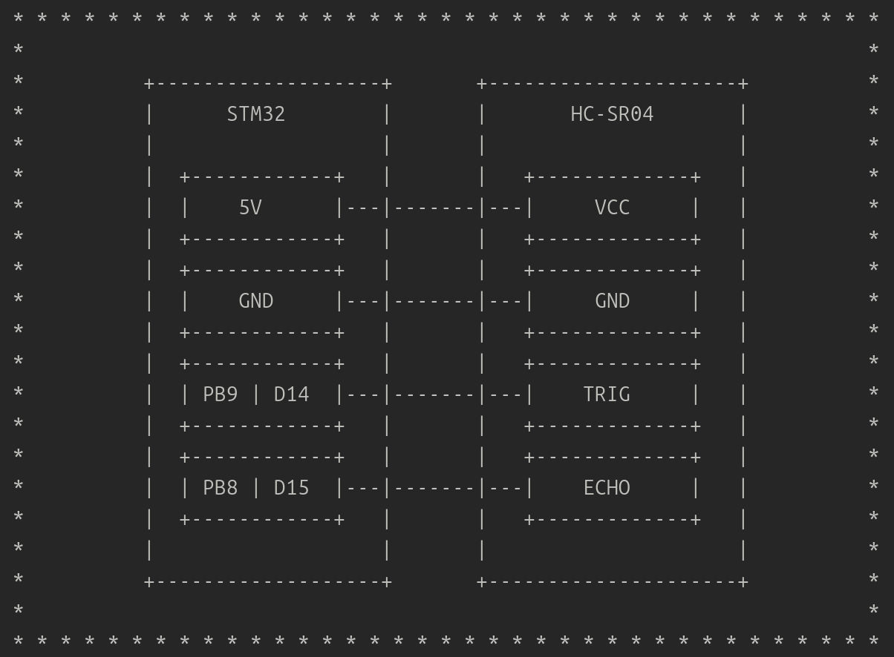

Иначе говоря:

- *5V → VCC;*
- *GND → GND;*
- *GPIO PB9 (D14) → TRIG;*
- *GPIO PB8 (D15) → ECHO.*

Все соединения в данном случае выполняются через макетную плату с использованием *Dupont* проводов (*male-to-male*). В проекте используются *Arduino*\-совместимые разъемы на плате *Nucleo* (см. таблицу «ARDUINO® connectors on NUCLEO-F446RE» в *STM32 Nucleo-64 boards User Manual*).

Подключение может выглядеть, например, так:

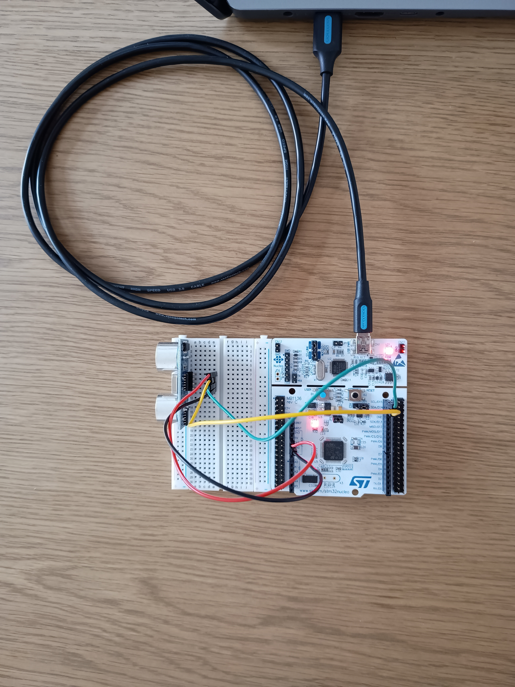

### Почему PB9 (D14) и PB8 (D15) имеют по два обозначения?

Ход рассуждения при *нахождении* контактов, когда они кем-то уже предложены и при самостоятельном *выборе*, несколько различается. Посмотрим на ход рассуждения для *самостоятельного* определения нужных контактов. Для работы системы «STM32 — HC-SR04» нужны два *GPIO*\-контакта (*pins*): один для того, чтобы послать импульс (излучение), другой — для получения обратного сигнала (эхо). Контакты *PB9 (D14)* и *PB8 (D15)* свободы и не конфликтуют с другими функциями микроконтроллера.

Посмотрим на схему в разделе «Hardware layout and configuration → Extension connectors» в *STM32 Nucleo-64 boards User Manual*:

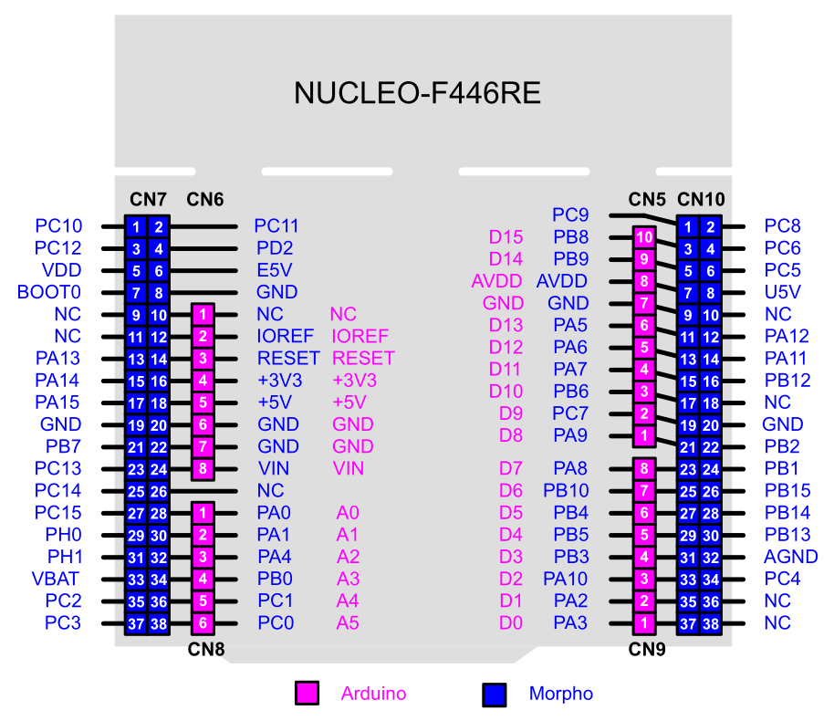

Справа вверху видим, что рядом с контактами *D15 (PB8)* и *D14 (PB9)* находятся ячейки с номерами 10 и 9, окрашенные в лиловый цвет. *Что означают все эти обозначения?*

Во-первых, числа внутри окрашенных ячеек — лиловых и синих — означают… номера разъемов — лиловых *Ардуино-коннекторов* и синих *морфоконнекторов*. В литературе и технической документации помимо наименований *ARDUINO® connectors* и *Morpho connectors* используют также *Arduino-compatible headers* для первых и *Berg pins* или *Morpho headers* — для вторых. Лиловым цветом обозначают «женские» разъемы (которые предполагают «мужские» провода для подключения к ним), синим цветом — разъемы «мужские», или штыревые (которые предполагают «женские» провода для подключения к ним). Эту пошлую *метафору* легко уловить и запомнить.

Во-вторых, в *User Manual* и других технических документах для Ардуино-совместимых плат разработки (например, *Nucleo*) используют **двойное именование контактов**: одна форма именования относится к схеме имен Ардуино (*Arduino naming scheme*), вторая — к стандартной системе наименований *STM32*. В чем разница?

- Схема имен Ардуино разделяет контакты на *цифровые и аналоговые*, обозначает их буквами «D» (*digital pin*) и «A» (*analog pin*) соответственно и добавляет номера. На предложенной схеме контакты *A0−A5* обозначают аналоговые выводы Ардуино, *D0−D15* — цифровые выводы.
- Стандартное соглашение *STM32* обозначает контакты двумя стоящими в ряд буквами (первая из которых — «P») и добавляет к ним номера: *PA0*, *PA1*, *PB5*, *PC7*... Буква «P» — сокращение слова «порт» (*port*). Следующей буквой, например «A», обозначается имя порта: например, «port A» — *PA*. Число, следующее за буквами, означает не что иное как порядковый номер вывода указанного порта. Например, имя *PC7* означает *седьмой вывод порта си (GPIO PORT C PIN 7)*.

Наименования выводов *на плате разработки* обозначены в соответствии со схемой имен Ардуино. Для программирования и конфигурации проекта *STM32CubeMX* с *HAL (Hardware Abstraction Layer)* используют стандартную систему наименований *STM32*.

Посмотрим в таблицу соответствий между наименованиями контактов *ARDUINO®* и *STM32* в технической документации *STM32 Nucleo-64 boards User Manual* → «Hardware layout and configuration» → «ARDUINO® connectors»:

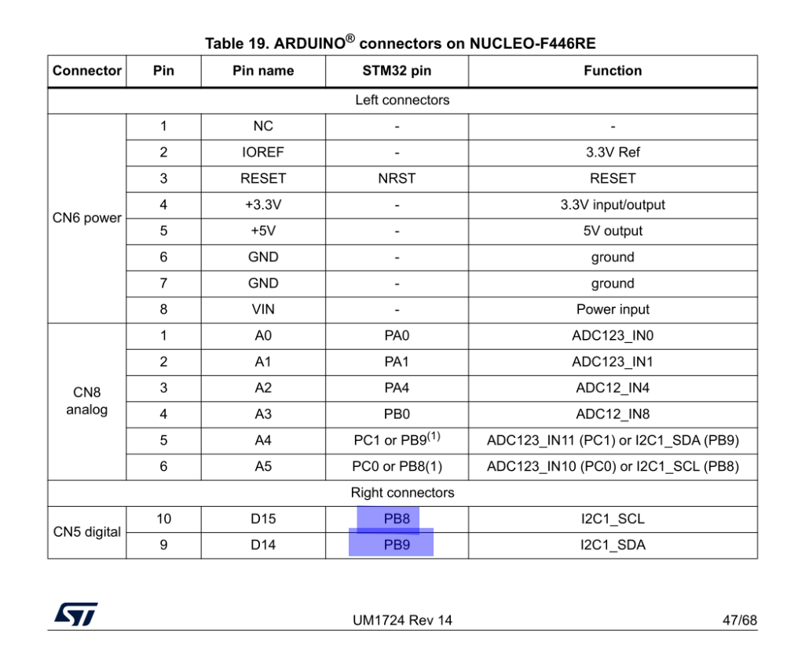

Видим, что:

- **Pin 10** (ячейка, окрашенная в лиловый цвет, с номером 10) **\= Pin name «D15»** (цифровой контакт Ардуино) **\= STM32 pin PB8** (восьмой вывод порта *B*);
- **Pin 9 = Pin name «D14» = STM32 pin PB9**.

Просто для понимания — мы находимся здесь:

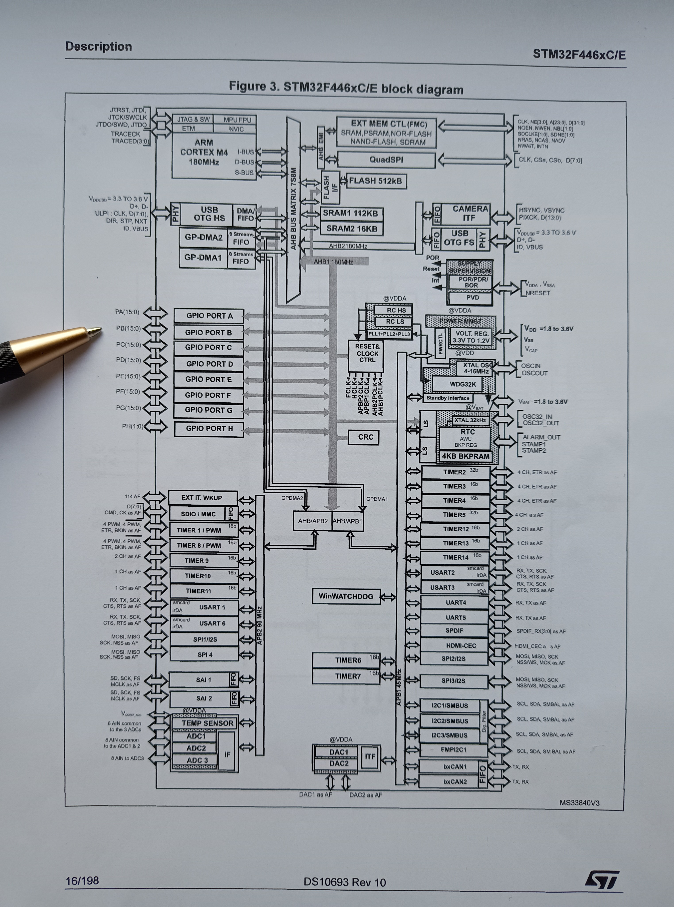

А также здесь:

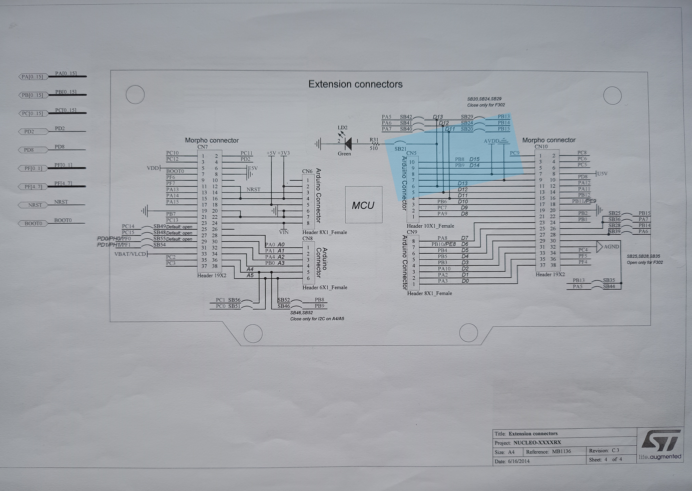

Можно заметить, что выбор контактов (разъемов) все еще происходит так, будто *заранее известно*, что *PB8* и *PB9* годятся для решения задачи. Если ненадолго остановиться на этом «заранее известном», можно наконец прояснить логику выбора и ответить на вопрос: «Как же все-таки *самостоятельно* определить нужный контакт?»

### Логика выбора контактов

При выборе контактов важно понимать их назначение. *Порассуждаем*.

Датчик *HC-SR04* имеет четыре вывода:

- **VCC** (питание);
- **GND** («земля»);
- **TRIG** (вход: принимает управляющий сигнал от микроконтроллера);
- **ECHO** (выход: передает сигнал обратно).

Со стороны *STM32*, кроме *VCC* и *GND*, требуются два *GPIO*\-контакта, чтобы:

- **Генерировать импульс** и подавать сигнал на *TRIG* → значит, нужен **выходной** контакт общего назначения (*GPIO Output*);
- **Считывать сигнал** с *ECHO* → значит, нужен **входной** контакт общего назначения (*GPIO Input*);

С питанием и «землей» все ясно — как уже сказано: *5V → VCC, GND → GND*. Какие именно два *GPIO*\-пина подойдут?

Сперва о **HC-SR04**. Согласно документации:

- Питание *HC-SR04* достигает *5V*;
- *HC-SR04* использует *5V CMOS*\-совместимые уровни (*0V = LOW, 5V = HIGH*), что соответствует уровню питания *VCC*;
- Если *VCC = 5V*, то и сигналы на *ECHO* и *TRIG* *\= 5V*.

Теперь об **STM32**:

- Выводы питания *5V* и *GND* легко найти на самой плате разработки;
- Для подачи сигнала на *TRIG* подойдет любой пин, поддерживающий функции общего ввода/вывода, например *PB9*;
- Какой *именно* «любой»? Такой, который поддерживает **GPIO** и... имеет **толерантность к 5V**;
- Посмотрим в *STM32F446xC/E Datasheet → Pinout and pin description* (*Legend/abbreviations used in the pinout table → Abbreviation → I/O*);
- *ECHO* будет возвращать *5V* для значения *HIGH*, следовательно, необходим *GPIO*\-пин, толерантный к напряжению *5V*;
- Снова смотрим *STM32F446xC/E Datasheet → Pinout and pin description*:
  - В таблице *Legend/abbreviations used in the pinout table* видим *Abbreviation → FT → 5V tolerant I/O*;
  - В таблице *STM32F446xx pin and ball descriptions* видим рядом с *PB8* и *PB9* обозначение *FT*.
- Таким образом, оба контакта подходят по функциям, безопасны по питанию, свободны и не конфликтуют с другими функциональными блоками, локализованы в Ардуино-разъемах (что удобно для подключений на макетной плате);
- Следовательно, будем использовать *PB8* (для *ECHO*) и *PB9* (для *TRIG*);
- Заметим, что *PB8* выбран для *ECHO*, поскольку он *5V*\-толерантный — иначе потребовался бы делитель напряжения (чтобы снизить уровень входного сигнала с *5V* до *3.3V*).

*Итак*, схема подключения:

- *5V → VCC;*
- *GND → GND;*
- *PB9 (D14) → TRIG;*
- *PB8 (D15) → ECHO.*

### Создание и конфигурация проекта

Откроем *STM32CubeIDE*, создадим рабочее пространство, если необходимо, затем создадим новый проект: *File > New > STM32 Project*.

- В появившемся меню *Target Selection* выберем, используя окно поиска, нужный микроконтроллер (*STM32F446RET6*) на плате *Nucleo*;
- Нажмем внизу панели *Next*;
- Укажем имя нового проекта и нажмем *Finish*;
- Согласимся на открытие *Device Configuration Tool* — перспективы *STM32CubeMX*.

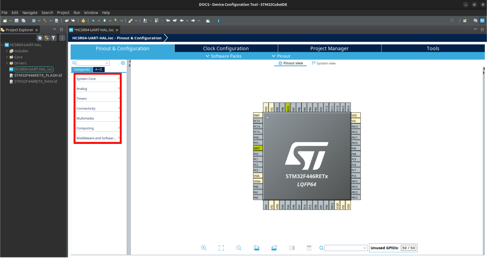

Слева видим поле настроек. Настраиваем:

- *System Core > RCC > High Speed Clock (HSE) > Crystal/Ceramic Resonator*  
  
  > представление *pinout view* активирует два контакта — *PH0 RCC_OSC_IN* и *PH1 RCC_OSC_OUT*;

- *Timers > TIM2 > Clock Source > Internal Clock | Parameter Settings > Counter Settings > Prescaler (PSC — 16 bits value) > 15*;

- *Connectivity > USART2 > Mode > Asynchronous*  
  
  > представление *pinout view* активирует два контакта — *PA2 USART2_TX* и *PA3 USART2_RX*.

Теперь настроим выбранные ранее *PB8* и *PB9* как *GPIO*. Для этого найдем эти имена в представлении *pinout view* и активируем прямо из него (нажатием курсора):

- *PB8* мы определили для *ECHO* — с точки зрения микроконтроллера это вход, тогда *PB8 > GPIO_Input*;
- *PB9* мы определили для *TRIG* — с точки зрения микроконтроллера это выход, тогда *PB9 > GPIO_Output*.

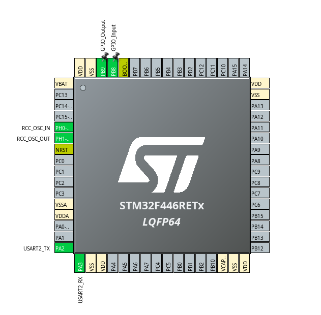

Сохраним конфигурацию проекта: *Ctrl+S* либо *Project > Generate Code*. Согласимся на генерацию кода и перейдем в перспективу *C/C++* (окно файла *main.c*).

Основной файл программы находится в *Имя_проекта > Core > Src > main.c* и уже содержит переменные и функции, необходимые для доступа к устройствам микроконтроллера. При использовании генерации кода *HAL* средствами *STM32CubeIDE | STM32CubeMX* следует сохранять разметку, определенную *STMicroelectronics*, и добавлять собственный код в специально отведенные для этого секции.

### Написание кода и модификация файла main.c

Прежде всего добавим флаг `-u _printf_float`: *Project > Properties > C/C++ Build > Settings > MCU/MPU Settings > Use float with printf from newlib-nano (-u \_printf_float) > Apply*.

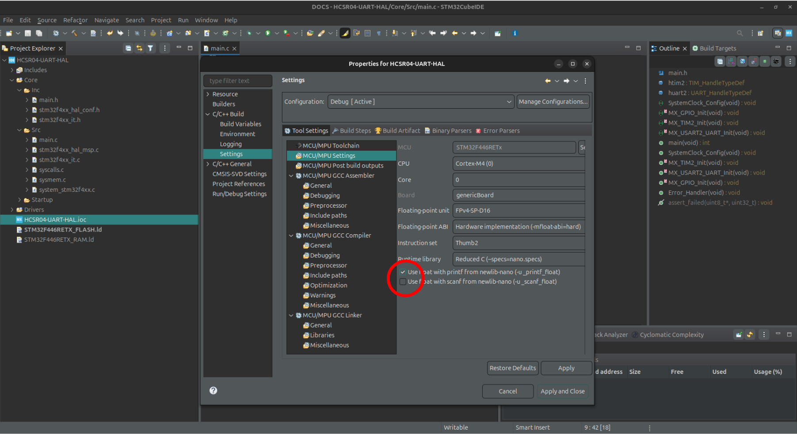

Эта настройка автоматически добавит флаг `-u _printf_float` в параметры компилятора, который укажет редактору связей (линковщику, *linker*) использовать поддержку чисел с плавающей точкой в функции `printf`. По умолчанию библиотека `newlib-nano`, которая используется в *STM32*, не поддерживает вывод чисел с плавающей точкой в `printf()` в целях экономии памяти. Флаг `-u _printf_float` включает поддержку типа `float` для функции `printf()`.

***Перейдем непосредственно к программе***

```C
/* * * * * * * * * * * * * * * * * * * * * * * * * * * * * * * * * * * * * * * * * * * * * *
 * @file           : main.c                                                                *
 * @brief          : Основной файл программы для измерения расстояния                      *
 *                   ультразвуковым датчиком HC-SR04 с использованием                      *
 *                   STM32F446RET6 и вывода данных по UART.                                *
 *                                                                                         *
 * Данная программа:                                                                       *
 *   - Использует TIM2, настроенный на 1 МГц (1 тик = 1 мкс), для генерации                *
 *     микрозадержек и измерения длительности импульса от датчика;                         *
 *   - Расчет скорости звука производит с учетом температуры воздуха;                      *
 *   - Генерирует импульс длительностью 10 мкс на выводе к TRIG для запуска измерения;     *
 *   - Использует ожидание сигнала от ECHO с использованием таймера и тайм-аута             *
 *     для предотвращения зависания в случае отсутствия сигнала;                           *
 *   - Измеряет длительность импульса (учитывая возможное переполнение таймера) и          *
 *     проводит фильтрацию по диапазону значений;                                          *
 *   - Расстояние вычисляет с учетом того, что измеренное время соответствует              *
 *     последовательному прохождению сигналом одного пути в двух направлениях;             *
 *   - Для повышения стабильности результата применяет усреднение трех измерений.          *
 *                                                                                         *
 * Подключение:                                                                            *
 *   - TRIG: GPIOB PIN9 (выход микроконтроллера);                                          *
 *   - ECHO: GPIOB PIN8 (вход микроконтроллера).                                           *
 *                                                                                         *
 * * * * * * * * * * * * * * * * * * * * * * * * * * * * * * * * * * * * * * * * * * * * * */

#include "main.h"
#include <stdio.h>
#include <string.h>

// Определения пинов ультразвукового датчика
#define TRIG_PIN GPIO_PIN_9   // Пин для триггерного сигнала.
#define ECHO_PIN GPIO_PIN_8   // Пин для приема эхо-сигнала.

// Глобальные переменные
TIM_HandleTypeDef htim2;
UART_HandleTypeDef huart2;

float calibration_factor = 1.0;  // Калибровочный коэффициент для коррекции измерений.
float temperature = 20.0;        // Температура воздуха в °C для расчета скорости звука.
char uart_buffer[100];           // Буфер для формирования строки, отправляемой по UART.

// Прототипы функций инициализации
void SystemClock_Config(void);
static void MX_GPIO_Init(void);
static void MX_TIM2_Init(void);
static void MX_USART2_UART_Init(void);

// Функция создания задержки в микросекундах с использованием TIM2
void micro_delay(uint32_t delay_us) {
  __HAL_TIM_SET_COUNTER(&htim2, 0); // Сброс счетчика таймера для начала отсчета.
  while (__HAL_TIM_GET_COUNTER(&htim2) < delay_us); // Цикл ожидания: пока счетчик не достигнет заданного значения (delay_us микросекунд).
}

/**
  * @brief  Основная функция приложения (точка входа).
  * @retval int
  */

int main(void) {
  // Объявление локальных переменных
  uint32_t pulse_start = 0;  // Значение таймера в момент начала эхо-импульса (в микросекундах).
  uint32_t pulse_end = 0;    // Значение таймера в момент окончания эхо-импульса.
  uint32_t pulse_width = 0;  // Разница между начальным и конечным значением, определяющая длительность эхо-импульса (pulse_end — pulse_start).
  uint32_t timeout = 30000;  // Максимальное время ожидания эхо-сигнала (30 мс).
  float distance = 0.0;      // Вычисленное расстояние до объекта (в сантиметрах).
  float sound_speed = 0.0;   // Скорость звука (в см/мкс), рассчитанная с учетом температуры воздуха.

  /* MCU Configuration---------------------------------------------------------*/
  /* Reset of all peripherals, Initializes the Flash interface and the Systick */
  HAL_Init();

  /* Configure the system clock */
  SystemClock_Config();

  // Инициализация GPIO, таймера и UART согласно конфигурации STM32CubeMX
  MX_GPIO_Init();
  MX_TIM2_Init();
  MX_USART2_UART_Init();

  // Запуск таймера TIM2 (используется для микрозадержек и для измерения длительности импульса)
  HAL_TIM_Base_Start(&htim2);

  // Расчет скорости звука с учетом температуры
  // Формула: v = 331.3 + 0.606 * temperature, где v – скорость звука в м/с
  // Перевод в см/мкс: 1 м/с = 100 см / 1,000,000 мкс = v / 10000 см/мкс
  // При 20°C получаем примерно: (331.3 + 0.606 * 20) / 10000 ≈ 0.03434 см/мкс
  sound_speed = (331.3 + 0.606 * temperature) / 10000.0;

  /* Infinite loop */
  while (1) {
    // **** Генерация триггерного импульса для HC-SR04 ****
    // Сброс пина TRIG в низкий уровень и краткая задержка в 4 мкс для стабилизации датчика
    HAL_GPIO_WritePin(GPIOB, TRIG_PIN, GPIO_PIN_RESET);
    micro_delay(4);

    // Генерация импульса высокого уровня длительностью в 10 мкс
    HAL_GPIO_WritePin(GPIOB, TRIG_PIN, GPIO_PIN_SET);
    micro_delay(10);
    HAL_GPIO_WritePin(GPIOB, TRIG_PIN, GPIO_PIN_RESET);

    // **** Ожидание появления сигнала на пине ECHO ****
    // Используем таймер для ограничения времени ожидания (тайм-аут),
    // чтобы избежать бесконечного цикла, если сигнал не будет получен
    uint32_t timeout_timer = __HAL_TIM_GET_COUNTER(&htim2); // Фиксируем время начала ожидания
    while (HAL_GPIO_ReadPin(GPIOB, ECHO_PIN) == GPIO_PIN_RESET) {
      // Если разница между текущим временем и временем начала ожидания превышает заданный тайм-аут, прерываем цикл ожидания
      if ((__HAL_TIM_GET_COUNTER(&htim2) - timeout_timer) > timeout) {
        break;
      }
    }

    // После цикла ожидания проверяем, установился ли пин ECHO в логическую единицу (HIGH):
    // если пин все еще LOW, значит сигнал не получен и измерение считается некорректным
    if (HAL_GPIO_ReadPin(GPIOB, ECHO_PIN) != GPIO_PIN_SET) {
      // Передаем сообщение об ошибке по UART и пропускаем текущее измерение
      HAL_UART_Transmit(&huart2, (uint8_t*)"Error: No echo\r\n", strlen("Error: No echo\r\n"), 100);
      HAL_Delay(2000);
      continue;
    }

    // **** Измерение длительности импульса на пине ECHO ****
    // Фиксируем время начала импульса
    pulse_start = __HAL_TIM_GET_COUNTER(&htim2);
    // Устанавливаем дополнительный тайм-аут для самого измерения импульса
    uint32_t pulse_timeout = pulse_start + timeout;

    // Ожидаем, пока пин ECHO остается HIGH:
    // если время измерения превысит заданный тайм-аут, выходим из цикла
    while (HAL_GPIO_ReadPin(GPIOB, ECHO_PIN) == GPIO_PIN_SET) {
      if (__HAL_TIM_GET_COUNTER(&htim2) > pulse_timeout) {
        break;
      }
    }

    // Фиксируем время окончания импульса
    pulse_end = __HAL_TIM_GET_COUNTER(&htim2);

    // **** Расчет длительности импульса с учетом переполнения таймера ****
    // Если счетчик не переполнился, разница между pulse_end и pulse_start даст длительность,
    // если же произошло переполнение (pulse_end < pulse_start), корректируем значение
    if (pulse_end >= pulse_start) {
      pulse_width = pulse_end - pulse_start;
    } else {
      pulse_width = (0xFFFFFFFF - pulse_start) + pulse_end;
    }

    // **** Фильтрация измерений ****
    // Игнорируем измерения, которые слишком малы (< 100 мкс, что соответствует ~1.7 см)
    // или слишком велики (> 25000 мкс, что соответствует ~425 см), так как они, вероятно, являются ошибочными
    if (pulse_width > 25000 || pulse_width < 100) {
      HAL_UART_Transmit(&huart2, (uint8_t*)"Invalid pulse\r\n", strlen("Invalid pulse\r\n"), 100);
      continue;
    }

    // **** Расчет расстояния ****
    // Используем формулу: distance = (pulse_width * sound_speed * calibration_factor) / 2:
    // деление на 2 объясняется тем, что измеренное время соответствует прохождению пути дважды
    distance = (pulse_width * sound_speed * calibration_factor) / 2.0;

    // **** Усреднение нескольких измерений ****
    // Для повышения стабильности результата сохраняем последние три измерения в статическом буфере,
    // затем вычисляем их среднее значение
    static float avg_buf[3] = {0};
    static uint8_t idx = 0;
    avg_buf[idx++] = distance;
    if (idx >= 3) idx = 0;
    float avg = (avg_buf[0] + avg_buf[1] + avg_buf[2]) / 3;

    // **** Передача результата по UART ****
    // Формируем строку с усредненным значением расстояния и отправляем ее по UART
    sprintf(uart_buffer, "Distance: %.1f cm\r\n", avg);
    HAL_UART_Transmit(&huart2, (uint8_t*)uart_buffer, strlen(uart_buffer), 100);

    // Небольшая задержка (200 мс) между измерениями
    HAL_Delay(200);
  }
}

/**
  * @brief System Clock Configuration
  * @retval None
  */

void SystemClock_Config(void) {
  RCC_OscInitTypeDef RCC_OscInitStruct = {0};
  RCC_ClkInitTypeDef RCC_ClkInitStruct = {0};

  /* Configure the main internal regulator output voltage */
  __HAL_RCC_PWR_CLK_ENABLE();
  __HAL_PWR_VOLTAGESCALING_CONFIG(PWR_REGULATOR_VOLTAGE_SCALE3);

  /* Initializes the RCC Oscillators according to the specified parameters
     in the RCC_OscInitTypeDef structure */
  RCC_OscInitStruct.OscillatorType = RCC_OSCILLATORTYPE_HSI;
  RCC_OscInitStruct.HSIState = RCC_HSI_ON;
  RCC_OscInitStruct.HSICalibrationValue = RCC_HSICALIBRATION_DEFAULT;
  RCC_OscInitStruct.PLL.PLLState = RCC_PLL_NONE;
  if (HAL_RCC_OscConfig(&RCC_OscInitStruct) != HAL_OK) {
    Error_Handler();
  }

  /* Initializes the CPU, AHB and APB buses clocks */
  RCC_ClkInitStruct.ClockType = RCC_CLOCKTYPE_HCLK|RCC_CLOCKTYPE_SYSCLK
                              |RCC_CLOCKTYPE_PCLK1|RCC_CLOCKTYPE_PCLK2;
  RCC_ClkInitStruct.SYSCLKSource = RCC_SYSCLKSOURCE_HSI;
  RCC_ClkInitStruct.AHBCLKDivider = RCC_SYSCLK_DIV1;
  RCC_ClkInitStruct.APB1CLKDivider = RCC_HCLK_DIV1;
  RCC_ClkInitStruct.APB2CLKDivider = RCC_HCLK_DIV1;

  if (HAL_RCC_ClockConfig(&RCC_ClkInitStruct, FLASH_LATENCY_0) != HAL_OK) {
    Error_Handler();
  }
}

/**
  * @brief TIM2 Initialization Function
  * @param Настроен на 1 МГц (1 тик = 1 мкс) при HSI 16 МГц: Prescaler = 15.
  * @retval None
  */

static void MX_TIM2_Init(void) {
  TIM_ClockConfigTypeDef sClockSourceConfig = {0};
  TIM_MasterConfigTypeDef sMasterConfig = {0};

  htim2.Instance = TIM2;
  htim2.Init.Prescaler = 15;
  htim2.Init.CounterMode = TIM_COUNTERMODE_UP;
  htim2.Init.Period = 4294967295;
  htim2.Init.ClockDivision = TIM_CLOCKDIVISION_DIV1;
  htim2.Init.AutoReloadPreload = TIM_AUTORELOAD_PRELOAD_DISABLE;
  if (HAL_TIM_Base_Init(&htim2) != HAL_OK) {
    Error_Handler();
  }
  sClockSourceConfig.ClockSource = TIM_CLOCKSOURCE_INTERNAL;
  if (HAL_TIM_ConfigClockSource(&htim2, &sClockSourceConfig) != HAL_OK) {
    Error_Handler();
  }
  sMasterConfig.MasterOutputTrigger = TIM_TRGO_RESET;
  sMasterConfig.MasterSlaveMode = TIM_MASTERSLAVEMODE_DISABLE;
  if (HAL_TIMEx_MasterConfigSynchronization(&htim2, &sMasterConfig) != HAL_OK) {
    Error_Handler();
  }
}

/**
  * @brief USART2 Initialization Function
  * @param None
  * @retval None
  */

static void MX_USART2_UART_Init(void) {  
  huart2.Instance = USART2;
  huart2.Init.BaudRate = 115200;
  huart2.Init.WordLength = UART_WORDLENGTH_8B;
  huart2.Init.StopBits = UART_STOPBITS_1;
  huart2.Init.Parity = UART_PARITY_NONE;
  huart2.Init.Mode = UART_MODE_TX_RX;
  huart2.Init.HwFlowCtl = UART_HWCONTROL_NONE;
  huart2.Init.OverSampling = UART_OVERSAMPLING_16;
  if (HAL_UART_Init(&huart2) != HAL_OK) {
    Error_Handler();
  }
}

/**
  * @brief GPIO Initialization Function
  * @param None
  * @retval None
  */

static void MX_GPIO_Init(void) {
  GPIO_InitTypeDef GPIO_InitStruct = {0};

  /* GPIO Ports Clock Enable */
  __HAL_RCC_GPIOH_CLK_ENABLE();
  __HAL_RCC_GPIOA_CLK_ENABLE();
  __HAL_RCC_GPIOB_CLK_ENABLE();

  /*Configure GPIO pin Output Level */
  HAL_GPIO_WritePin(GPIOB, TRIG_PIN, GPIO_PIN_RESET);

  /*Configure GPIO pin: PB8 */
  GPIO_InitStruct.Pin = ECHO_PIN;
  GPIO_InitStruct.Mode = GPIO_MODE_INPUT;
  GPIO_InitStruct.Pull = GPIO_NOPULL;
  HAL_GPIO_Init(GPIOB, &GPIO_InitStruct);

  /*Configure GPIO pin: PB9 */
  GPIO_InitStruct.Pin = TRIG_PIN;
  GPIO_InitStruct.Mode = GPIO_MODE_OUTPUT_PP;
  GPIO_InitStruct.Pull = GPIO_NOPULL;
  GPIO_InitStruct.Speed = GPIO_SPEED_FREQ_LOW;
  HAL_GPIO_Init(GPIOB, &GPIO_InitStruct);
}

/**
  * @brief  This function is executed in case of error occurrence.
  * @retval None
  */

void Error_Handler(void) {
  /* User can add his own implementation to report the HAL error return state */
  __disable_irq();
  while (1) {
  }
}

#ifdef  USE_FULL_ASSERT

/**
  * @brief  Reports the name of the source file and the source line number
  *         where the assert_param error has occurred.
  * @param  file: pointer to the source file name
  * @param  line: assert_param error line source number
  * @retval None
  */

void assert_failed(uint8_t *file, uint32_t line) {
  /* User can add his own implementation to report the file name and line number,
     ex: printf("Wrong parameters value: file %s on line %d\r\n", file, line) */
}

#endif /* USE_FULL_ASSERT */
```

Часть *HAL*\-кода, которая связана с конфигурацией проекта *STM32CubeMX*, автоматически генерируется *STM32CubeIDE*. Объясним те части программы, которые были написаны нами *вручную*.

**1\. Глобальные переменные и их назначение**

- `calibration_factor`. Калибровочный коэффициент — это корректирующий множитель, который позволяет компенсировать *систематические* погрешности в измерениях. По умолчанию он установлен в 1.0 и не влияет на измеренное значение. Однако, если в ходе тестирования окажется, что результаты измерений отличаются от реальных, этот коэффициент можно скорректировать (например, установить значение 1.05 или 0.95). Этот коэффициент нужен для гибкой настройки системы, он позволяет добиться более точного соответствия измеренных данных с фактическими значениями без изменения основной логики измерений.

- `temperature`. Значение температуры (в градусах Цельсия), используемое для вычисления скорости звука. Поскольку скорость звука зависит от температуры воздуха, использование этой переменной позволяет учесть изменения среды для повышения точности измерений.

- `uart_buffer`. Буфер для формирования строки с результатами измерения, которая затем передается по *UART* на экран компьютера (или другое устройство). Иначе говоря, буфер для хранения результата вычислений.

**2\. Временные функции**

- `micro_delay` реализует точную задержку *в микросекундах*, используя таймер *TIM2*, настроенный для отсчета времени на частоту 1 МГц (1 тик = 1 мкс). Эта функция используется для формирования кратковременных задержек, например, для создания 10-микросекундного импульса на пине *TRIG*.
  
  > Функция `micro_delay` работает путем опроса значения счетчика таймера. Перед началом измерения происходит сброс таймера. Функция задержки просто ждет, пока счетчик достигнет нужного значения.

- `HAL_Delay` — функция библиотеки *HAL*, создающая блокирующую задержку *в миллисекундах* (например, 200 мс между измерениями или 2000 мс при ошибке). Она предназначена для менее критичных по точности пауз и работает через системный таймер (*SysTick*).

**3\. Основной цикл программы (функция `main`)**

- **Генерация триггерного импульса**. Реализована логика, при которой подается импульс высокого уровня на пин *TRIG* длительностью 10 мкс (или 10 тиков таймера при частоте 1 МГц). Перед подачей импульса пин на некоторое время устанавливается в низкий уровень для стабилизации датчика.
  
  > Те, кто знаком с лингвистикой, легко сопоставят эту логику с логикой *детерминативов*, например, в аккадском языке. Представим себе гипотетическую логограмму «десять щелчков», которая как-то кодирует следующее за ней сообщение. Десять тиков таймера, которые кодируют инициализацию, означают *начало отсчета*, но сами не идут в счет времени.

- **Ожидание сигнала на пине ECHO (тайм-аут)**. В цикле ожидания фиксируется текущее значение времени, после чего программа запускает ожидание того, что пин *ECHO* перейдет в высокий уровень. Иначе говоря, происходит логическая проверка в цикле (сравнение текущего значения времени с установленным пределом). При превышении заданного *времени ожидания, или тайм-аута* (30 мс), цикл прерывается и выполняется проверка состояния пина. Если сигнал не получен, происходит отправка сообщения об ошибке по *UART*, измерение пропускается. Это сделано для предотвращения «зависаний» программы при отсутствии эхо-сигнала.
  
  > В программе используется тайм-аут 30 мс. Стоит заметить, что это значение берется из максимального расстояния, которое может измерить *HC-SR04* (400 см).
  > 
  > Время ожидания, или тайм-аут, не следует путать с функциями времени задержек (*delay*), упомянутыми выше. Тайм-аут — это попросту предел времени ожидания какого-либо события. В нашем случае событием является появление сигнала на пине *ECHO*. При превышении этого предела программа прерывает ожидание, чтобы не «застрять» в бесконечном цикле.

- **Измерение длительности импульса**. После обнаружения высокого уровня на пине *ECHO* фиксируется время начала импульса, а когда сигнал снова становится низким — время окончания. При этом предусмотрена защита от переполнения таймера. Если значение счетчика переполняется, длительность импульса вычисляется корректно, путем учета разницы между максимальным значением счетчика и текущими показателями.

- **Фильтрация полученных данных**. Для повышения надежности измерений введена фильтрация: если длительность импульса оказывается слишком малой или слишком большой (что может быть вызвано шумами или ошибками), такие измерения отбрасываются, и система переходит к следующему циклу.
  
  > В коде отбрасываются импульсы короче 100 мкс и длиннее 25000 мкс. Это соответствует расстояниям ~1.7 см и ~425 см: *HC-SR04*, как уже было сказано, имеет ограниченный диапазон измерений (2–400 см).

- **Усреднение измерений**. Для получения более стабильного результата реализовано усреднение последних трех измерений. Это помогает сгладить случайные колебания и шумы, повышая точность выводимого результата.
  
  > Стоит учесть, что на старте программы буфер заполнен нулями, так что для первых нескольких измерений могут быть искажения.

- **Передача данных по UART**. Результат — усредненное значение расстояния — формируется в строку и отправляется по *UART* на экран компьютера.

Представим в виде блок-схемы:

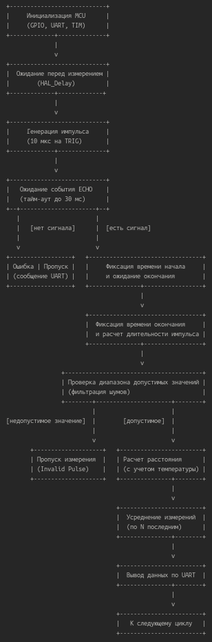

### Сборка проекта

> Текст программы для сборки приведен в основном файле проекта (cм. текущий репозиторий *GitHub*: *HCSR04-UART-HAL* *\> Core > Src > main.c*).

Соберем проект: *Project > Build Project*. В консоли увидим вывод сообщения об успешном и безошибочном окончании сборки.

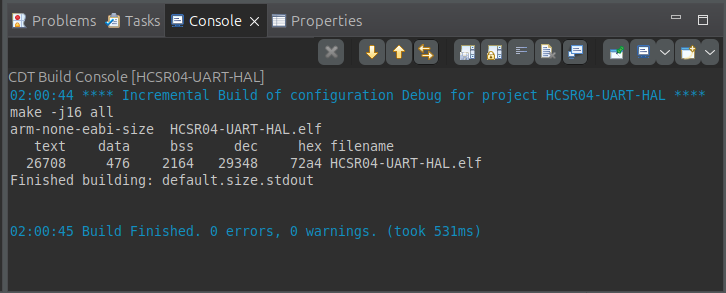

*\* Этап отладки опустим.*

### Настройка Minicom

- Сперва подключим плату разработки к компьютеру через *USB*\-кабель.
- Вызовем терминал *Linux*: `Ctrl+Alt+T`. Введем `sudo dmesg | grep tty`, чтобы узнать имя последовательного порта.
- Имя — это `tty` плюс что-то еще, например, `ttyACM0`.
- Введем в терминал *Linux* команду `minicom -s`, чтобы вызвать режим конфигурации *Minicom*.
- Увидим меню.

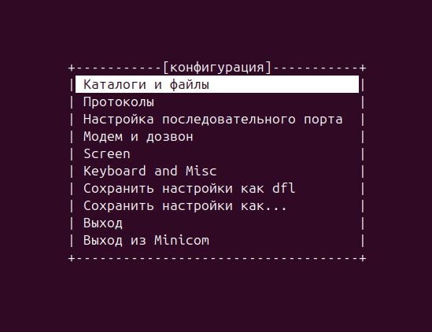

Нас интересует: *Настройка последовательного порта > A*. Вместо указанного по умолчанию имени последовательного порта введем то, которое узнали, использовав `sudo dmesg | grep tty`. Синтаксис следующий: `A — Последовательный порт: /dev/ttyACM0`. Затем *Enter > Enter > Выход* (из меню конфигурации, но не из *Minicom*).

Если плата разработки подключена к *USB*\-порту компьютера, увидим строку «Добро пожаловать в *Minicom x.x*». Оставим на время окно терминала и перейдем к прошивке микроконтроллера.

### Прошивка микроконтроллера

Плата разработки подключена к *USB*\-порту компьютера. Откроем *STM32CubeProgrammer*. Проверим обновление прошивки для *ST-Link*. Выберем в окне *ST-Link Configuration > Serial number* свою плату разработки. Нажмем кнопку *Firmware upgrade*. Во всплывающем окне выберем свой *ST-Link*. Затем — *Open in update mode*. Сравним текущую версию прошивки с той, которая предлагается для обновления. Обновим либо выйдем из меню окна обновлений.

В основном окне *STM32CubeProgrammer* выберем *ST-Link*, нажмем *Connect*.

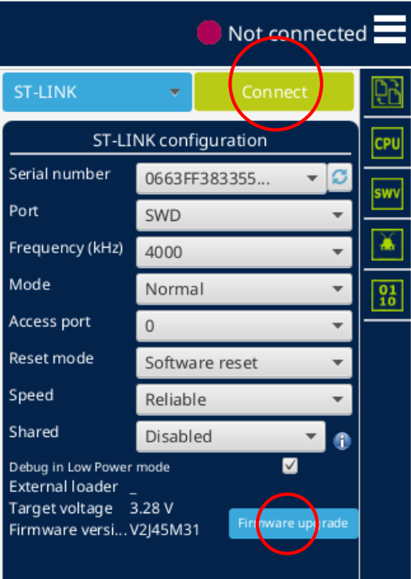

После подключения увидим отображение адресного пространства, обновление логов и информацию о подключенном устройстве. В левой панели вверху найдем изображение, которое ведет в меню *Erasing & Programming*.

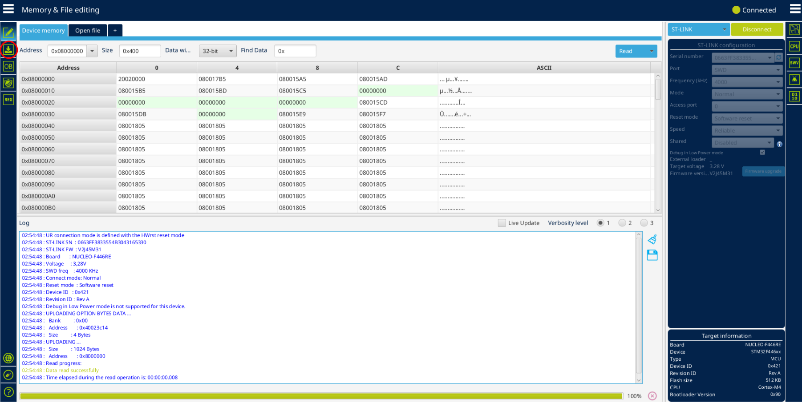

В меню *Erasing & Programming* будем загружать в память микроконтроллера исполняемый двоичный файл в формате `.elf` (*Executable and Linkable Format*), который появился в результате сборки проекта.

Выбираем *File Path > Browse* и находим в проекте, созданном *STM32CubeIDE*, файл `.elf`: *... > HCSR04-UART-HAL > Debug > HCSR04-UART-HAL.elf*. Флажки *Verify programming* и *Run after programming* оставляем включенными (или включаем). Нажимаем *Start Programming*.

Закроем окна с сообщениями об успешной прошивке и перейдем в окно терминала, где работает *Minicom*.

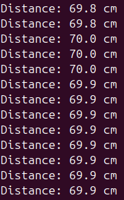

### Послесловие и калибровка

Микропрограмма добавлена в память микроконтроллера, в терминале видим результат ее работы.

Время от времени значение расстояния, выводимое на экран, может без явных на то причин существенно изменяться («скачет»), а иногда мы и вовсе получаем вывод «Invalid pulse». *В чем может быть дело?*

Сообщения «Invalid pulse» появляются, когда длительность импульса выходит за пределы диапазона, указанного нами в программном фильтре (&lt; 100 µs или &gt; 25000 µs).

```C
if (pulse_width > 25000 || pulse_width < 100) {
      HAL_UART_Transmit(&huart2, (uint8_t*)"Invalid pulse\r\n", strlen("Invalid pulse\r\n"), 100);
      continue;
    }
```

&nbsp;*Но чем это может быть вызвано?* Причины могут быть разными:

- шум или ложные срабатывания датчика;
- нестабильный сигнал *ECHO* из-за угла отражения или слабого отражения;
- возможные помехи, особенности установки;
- &lt;...&gt;

*Что с этим делать?* Шаги и пробы могут быть разными:

- настроить пороговые значения (скорректировать программные фильтры, изменив минимальное и/или максимальное значение длительности импульса);
- улучшить аппаратное подключение (добавить конденсатор для фильтрации шумов или улучшить крепление датчика);
- улучшить программное усреднение (попробовать усреднять больше измерений и/или отбрасывать отказы, чтобы случаи «Invalid pulse» не влияли на конечный результат);
- увеличить значение времени ожидания (тайм-аут);
- &lt;...&gt;

Что касается «скачков» значения в выводе, можно попробовать увеличить задержку между измерениями (`HAL_Delay`). При задержке в 200 мс обновление происходит ~5 раз в секунду. Такой темп обновления вполне нормален (типичен для многих роботизированных систем), но если датчик не получает корректный сигнал, стоит подумать о калибровке времени задержки.

Итак, **дальнейшая работа** по улучшению *текста и логики программы* может предполагать эксперименты с калибровочным коэффициентом (`calibration_factor`), оптимизацией фильтрации и усреднения (попробовать внедрить медианный фильтр или увеличить глубину усреднения для подавления шумов), настройкой временных параметров (*delay* и *timeout*).

Логичным *с точки зрения текста программы* является добавление в систему *аппаратного* модуля температурной компенсации — интеграция датчика температуры для автоматического пересчета скорости звука при изменении состояния среды.
